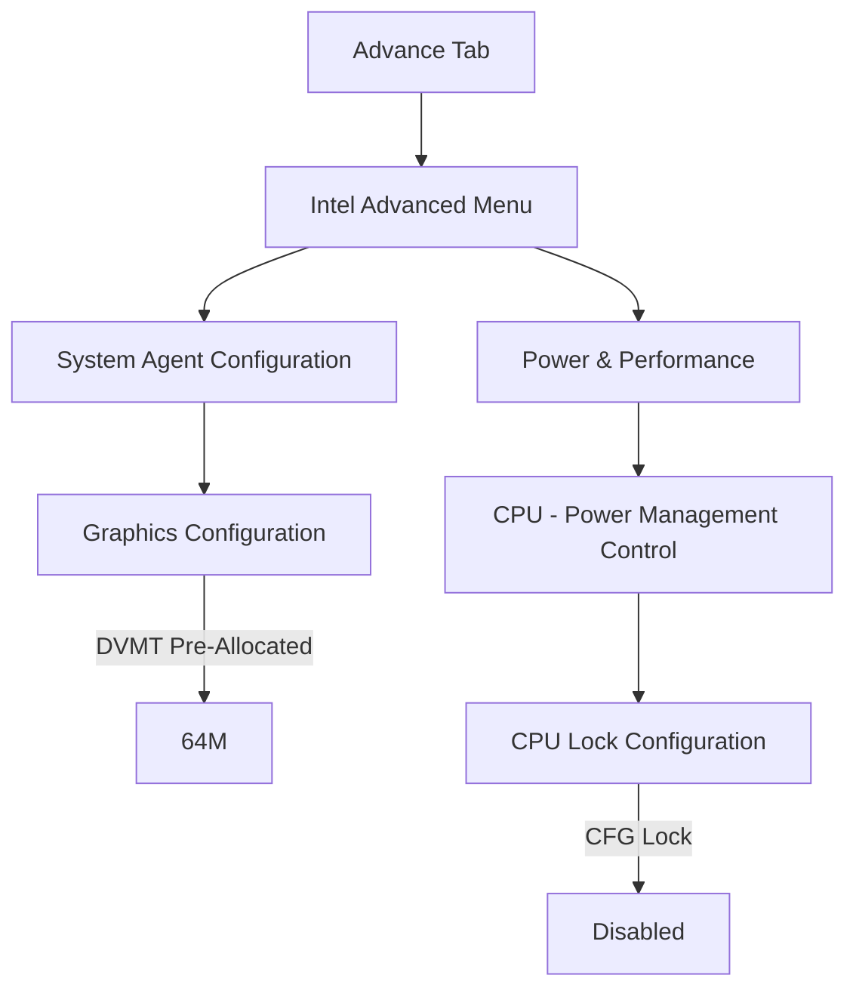
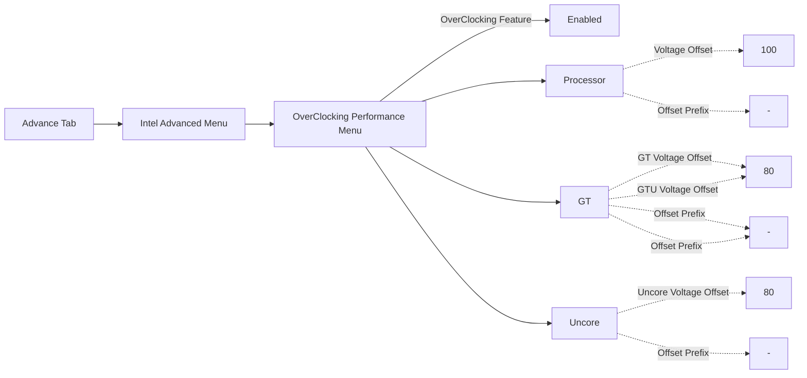
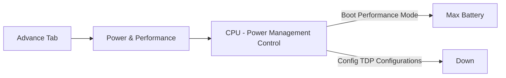
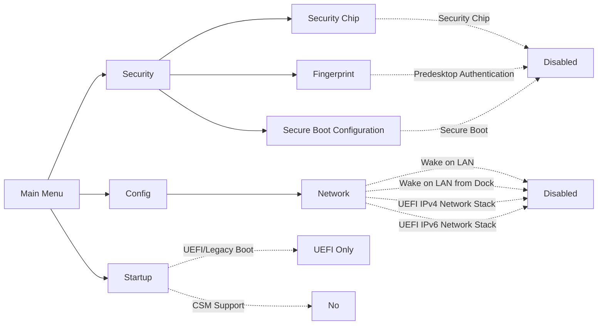
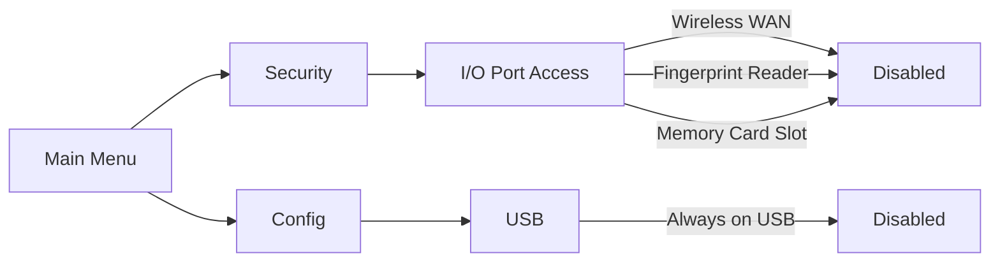
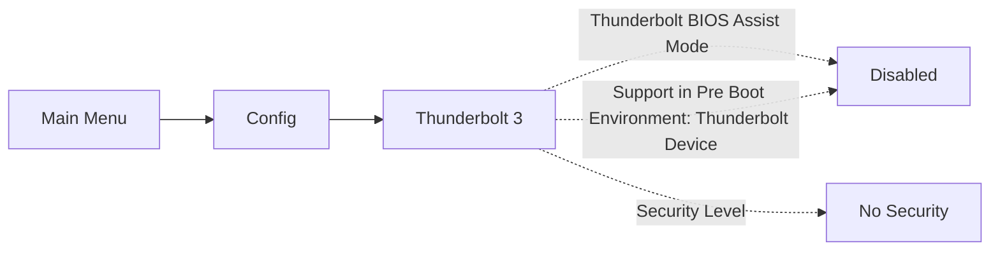

# BIOS Prep

Modding the machine's BIOS is **optional** and will unlock hidden advanced settings. These settings allow for better optimizations under macOS.

/// danger
The BIOS mod will **permanently** break TPM.

Only mod the BIOS if you do not need TPM under Windows or Linux.
///

[:material-fast-forward-outline: Skip to Vanilla BIOS Settings](#vanilla-bios-settings){ .md-button }

## BIOS Modding

{ align=right width=200 }

The CH341a SPI Programmer and SOIC8 Clip are needed to dump and flash the BIOS chip. An inexpensive one from Amazon/eBay is sufficient.

The BIOS chip is located just above the CPU, hidden under the sticker shield.

<figure markdown>
  { width=300 }
  <figcaption>BIOS Chip Location</figcaption>
</figure>

[:simple-github:{.github} digmorepaka/thinkpad-firnware-patches](https://github.com/digmorepaka/thinkpad-firmware-patches){ .md-button }

/// announce | Credits
Thank you to `paranoidbashthot` and `\x` for creating the patches.
///

[:simple-youtube:{ .youtube } @notthebee](https://github.com/notthebee) similarly modded his BIOS in [:simple-youtube:{ .youtube } Removing Wi-Fi Whitelist ... & Unlocking Advanced BIOS Settings](https://www.youtube-nocookie.com/embed/ce7kqUEccUM)

1. Use `xx_80_patches-v*.txt`, feel free to comment out the WWAN patches if unnecessary.

3. Remember to **dump the vanilla twice and use `diff` to make sure things were dumped properly**, store this backup somewhere safe.
4. Confirmed working `BIOS-v1.45`, I cannot be sure about other BIOS versions. Though they will most likely work as well.
5. The modded BIOS does not need to be signed by `thinkpad-eufi-sign`. Remember to replace `4C 4E 56 42 42 53 45 43 FB` with `4C 4E 56 42 42 53 45 43 FF` on the patched BIOS.

6. Your BIOS chip may not be made by Winbond, but by Macronix instead. In that case, add the argument `-c MX25L12835F/MX25L12845E/MX25L12865E` to `flashrom`. See [Issue #116](https://github.com/tylernguyen/x1c6-hackintosh/issues/116#issuecomment-778654320)``

/// success
Successfully modding your BIOS will reveal the `Advance Menu` tab.

It is safe to update the BIOS. However, the patches will have to be reapplied and reflashed.
///

## Modded BIOS Settings

DVMT Pre-Allocated will enable 4K HDMI output.
Disabling CFG Lock gives Kernel (XNU) and AppleIntelPowerManagement the ability to write to the MSR 0xE2 register.

### Optimization Settings

/// tip | Undervolting
I also recommend undervolting your machine. Be sure to verify your resulting by stress testing with `Prime95` and `Heaven Benchmark`.

The following are stable settings for my x1c6 with `i7-8650U`, repasted with Thermal Grizzly.
///

/// setting | Optimize CPU **performance** at the cost of battery
///

/// setting | Optimize **battery time** at the cost of performance
///

## Vanilla BIOS Settings

These BIOS settings must be made to install and run macOS without any problems:

/// tip
You can also disable hardware/features you do not need to save power, some examples are:
///

### Thunderbolt 3 Settings

/// setting | Thunderbolt 3 Coldplug
If you **DO NOT use Thunderbolt 3 hotplug** in macOS (don't mind shutting down the machine to connect TB3 devices), this will drastically lower power consumption:
///

/// setting | Thunderbolt 3 Hotplug
If you **DO use Thunderbolt 3 hotplug in macOS** (at the expense of idle power consumption):
///

