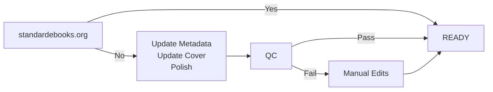
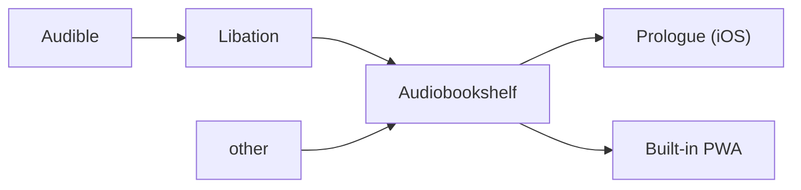

# Read

## Books

<div class="grid cards" markdown>

- { .twemoji } [Calibre :octicons-arrow-up-right-16:](https://calibre-ebook.com/)
[:octicons-container-16:{ .docker }](https://hub.docker.com/r/linuxserver/calibre){ .card-link title=Container}

- { .twemoji } [Kavita :octicons-arrow-up-right-16:](https://www.kavitareader.com/)
[:octicons-container-16:{ .docker }](https://hub.docker.com/r/linuxserver/kavita){ .card-link title=Container}
[:fontawesome-regular-file-code:](https://github.com/Kareadita/Kavita){ .card-link title="Source Code" }

- :simple-koreader:{ .koreader } [KOReader :octicons-arrow-up-right-16:](https://github.com/koreader/koreader)

</div>

### { .twemoji } [Calibre :octicons-arrow-up-right-16:](https://calibre-ebook.com/)

<div align="center">



</div>

/// extension | Plugins
- [janlarres/apple-books-covers :octicons-arrow-up-right-16:](https://github.com/janlarres/apple-books-covers)
  { .twemoji }
  { .twemoji }
  { .twemoji }
  { .twemoji }
- [Hardcover by RobBrazier :octicons-arrow-up-right-16:](https://github.com/RobBrazier/calibre-plugins/tree/main/plugins/hardcover)
  { .twemoji }
  { .twemoji }
  { .twemoji }
  { .twemoji }
- [NotSimone/Kobo-Metadata :octicons-arrow-up-right-16:](https://github.com/NotSimone/Kobo-Metadata)
  { .twemoji }
  { .twemoji }
  { .twemoji }
  { .twemoji }
- [jbhul/Audiobookshelf-calibre-plugin :octicons-arrow-up-right-16:](https://github.com/jbhul/Audiobookshelf-calibre-plugin)
  { .twemoji }
  { .twemoji }
  { .twemoji }
  { .twemoji }
- [harmtemolder/koreader-calibre-plugin :octicons-arrow-up-right-16:](https://github.com/harmtemolder/koreader-calibre-plugin)
  { .twemoji }
  { .twemoji }
  { .twemoji }
  { .twemoji }
///

/// setting | Settings
- Save template: `{series:'re(ifempty($,field('title')),':',' -')'}/{series:'re(ifempty($,field('title')),':',' -')'}{series_index:0>2s| - |}`
- Polish books:
    - [x] Smarten punctuation
    - [x] Update medata in the book files
    - [x] Update the cover in the book files
    - [x] Losslessly compress images
    - [x] Download external resources
    - [x] Add soft hyphens
    - [x] Upgrade book internals
///

### :simple-koreader:{ .koreader } [KOReader :octicons-arrow-up-right-16:](https://github.com/koreader/koreader)

KOReader is an <span class="solarized-orange">:material-source-branch: __open source__</span> and extensible reader for e-ink devices.

Aside from my computer, I mostly read eBooks on my [__Kobo Clara BW__](https://us.kobobooks.com/products/kobo-clara-bw).

See :simple-refinedgithub:{ .foreground } KOReader: [Installation on Kobo devices :octicons-arrow-up-right-16:](https://github.com/koreader/koreader/wiki/Installation-on-Kobo-devices).

KOReader is __VERY__ customizable and integrates well with Calibre. Anecdotally, I also think it handles ebook formats, especially `.epub`, better than other viewer software.

/// extension | Plugins and Patches
- [hardcoverapp.koplugin :octicons-arrow-up-right-16:](https://github.com/Billiam/hardcoverapp.koplugin) to scrobble reading records to { .twemoji } Hardcover.
///

/// setting | Settings
- [Bookerly :octicons-arrow-up-right-16:](https://developer.amazon.com/en-US/alexa/branding/echo-guidelines/identity-guidelines/typography) as the default reading font.
- [Berkeley Mono :octicons-arrow-up-right-16:](https://usgraphics.com/products/berkeley-mono) as the UI font.
///

## Audiobooks

/// question | [IS AUDIOBOOK READING? :octicons-arrow-up-right-16:](https://www.google.com/search?q=is+audiobook+reading)
:lucide-check-check:{ .solarized-green } __Yes__, how else would blind people `read` ?
///

<div class="grid cards" markdown>

- { .twemoji } [Libation :octicons-arrow-up-right-16:](https://github.com/rmcrackan/Libation)
[:octicons-container-16:{ .docker }](https://hub.docker.com/r/rmcrackan/libation/tags){ title=Container}
[:lucide-file-code-corner:](https://github.com/rmcrackan/Libation){ title="Source Code" }

- { .twemoji } [Audiobookshelf :octicons-arrow-up-right-16:](https://www.audiobookshelf.org/)
[:octicons-container-16:{ .docker }](https://github.com/advplyr/audiobookshelf/pkgs/container/audiobookshelf){ .card-link title=Container}
[:fontawesome-regular-file-code:](https://github.com/advplyr/audiobookshelf){ .card-link title="Source Code" }

- { .twemoji } [Prologue (iOS) :octicons-arrow-up-right-16:](https://apps.apple.com/us/app/prologue-audiobook-player/id1459223267)

</div>

<div align="center">



</div>

- Audiobooks from :simple-audible:{ .audible } Audible are archived in `.m4b` using { .twemoji } Libation.
- DRM-free audiobook files are manually renamed and organized. I haven't figured out an automation workflow for this yet.

```json title="Libation - Settings.json"
{
  "FolderTemplate": "<first author>/ <title short> (<year>) [<id>]",
  "FileTemplate": "<title> (<year>) [<id>]"
}
```

- `[<id>]` is the :simple-audible:{ .audible } Audible book ID, ASIN.

This is what the audiobooks dir looks like.

```Ruby
audiobooks/
├─ Viet Thanh Nguyen/
│  ├─ The Sympathizer (2014) [B00W1Y6MOQ]/
│  │  ├─ The Sympathizer (2014) [B00W1Y6MOQ].m4b
│  │  ├─ cover.jpg
│  │  ├─ metadata.json
│  │  ├─ metadata.abs
│  ├─ The Committed (2021) [B08SYKJP69]/
├─ Chang-Rae Lee/
├─ David Grann/
├─ .../
```

- { .twemoji } Audiobookshelf manages `cover.jpg`, `metadata.json`, `metadata.abs`.
- Preferred format is `.m4b`, strictly 1 file per book.
