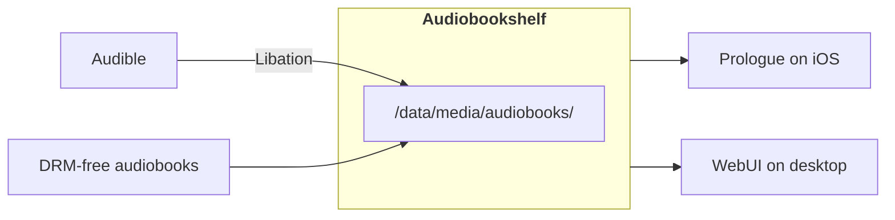

# Audiobooks

> [!question] [IS AUDIOBOOK READING? :lucide-arrow-up-right:](https://www.google.com/search?q=is+audiobook+reading)
> :lucide-check-check:{ .solarized-green } __Yes__, how else would blind people `read` ?

<div align="center">



</div>

```Ruby title="/data/media/audiobooks/"
audiobooks/
├─ Viet Thanh Nguyen/
│  ├─ The Sympathizer (2014) [B00W1Y6MOQ]/
│  │  ├─ The Sympathizer (2014) [B00W1Y6MOQ].m4b
│  │  ├─ cover.jpg
│  │  ├─ metadata.json
│  │  ├─ metadata.abs
│  ├─ The Committed (2021) [B08SYKJP69]/
├─ Chang-Rae Lee/
├─ David Grann/
├─ .../
```

- `cover.jpg`, `metadata.json`, and `metadata.abs` are managed by Audiobookshelf.

<div class="grid cards" markdown>

- ### { .twemoji } [Libation :lucide-arrow-up-right:](https://github.com/rmcrackan/Libation)

</div>

```json title="Settings.json"
{
  "FolderTemplate": "<first author>/ <title short> (<year>) [<id>]",
  "FileTemplate": "<title> (<year>) [<id>]"
}
```
Where `[<id>]` is the Amazon Standard Identification Number (ASIN).

<div class="grid cards" markdown>

- ### { .twemoji } [Audiobookshelf :lucide-arrow-up-right:](https://www.audiobookshelf.org/)

</div>

1. Match and update metdata.
2. Update chapter markers.
3. Update chapter titles.
4. Make `.m4b` file.

<div class="grid cards" markdown>

- ### { .twemoji } [Prologue :lucide-arrow-up-right:](https://apps.apple.com/us/app/prologue-audiobook-player/id1459223267)

</div>
