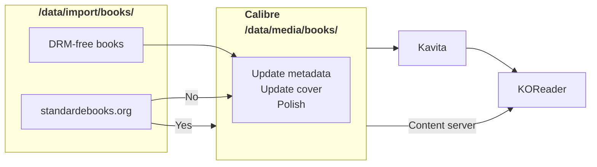

# Books

<div align="center">



</div>

``` title="/data/"
/data/
├─ import/
│  ├─ books/
├─ media/
│  ├─ books/
│  │  ├─ Kazuo Ishiguro/
│  │  ├─ Patrick Radden Keefe/
│  │  ├─ metadata.db
│  │  ├─ ...
├─ ...
```

- `metadata.db` is the Calibre database file.

<div class="grid cards" markdown>

- ### { .twemoji } [Calibre :lucide-arrow-up-right:](https://calibre-ebook.com/)

</div>

- Watches `/data/media/import/books/`, and imports to `/data/media/books/`.
- Serve as content server for KOReader.

``` title="Preferences --> Saving books to disk --> Save template"
{series:'re(ifempty($,field('title')),':',' -')'}/{series:'re(ifempty($,field('title')),':',' -')'}{series_index:0>2s| - |}
```

> [!extension]- Calibre Plugins
> - [janlarres/apple-books-covers :lucide-arrow-up-right:](https://github.com/janlarres/apple-books-covers)
>
> Default source for high-resolution book covers.
>
> - [Hardcover by RobBrazier :lucide-arrow-up-right:](https://github.com/RobBrazier/calibre-plugins/tree/main/plugins/hardcover)
>
> Fetches Hardcover identifier information, which is useful for tracking/syncing book progress to Hardcover.
>
> - [jbhul/Audiobookshelf-calibre-plugin :lucide-arrow-up-right:](https://github.com/jbhul/Audiobookshelf-calibre-plugin)
>
> Syncs metadata with Audiobookshelf server.
>
> - [harmtemolder/koreader-calibre-plugin :lucide-arrow-up-right:](https://github.com/harmtemolder/koreader-calibre-plugin)
>
> Syncs metadata with KOReader.

> [!setting]- Settings: Polish books
> - [x] Smarten punctuation
> - [x] Update medata in the book files
> - [x] Update the cover in the book files
> - [x] Losslessly compress images
> - [x] Download external resources
> - [x] Add soft hyphens
> - [x] Upgrade book internals

<div class="grid cards" markdown>

- ### { .twemoji } [Kavita :lucide-arrow-up-right:](https://www.kavitareader.com/)

</div>

Reads `/data/media/books/`, serve using PWA.

<div class="grid cards" markdown>

- ### :simple-koreader:{ .koreader } [KOReader :lucide-arrow-up-right:](https://github.com/koreader/koreader)

</div>

> [!extension] Plugins
> - [hardcoverapp.koplugin :lucide-arrow-up-right:](https://github.com/Billiam/hardcoverapp.koplugin) to scrobble reading records to { .twemoji } Hardcover.

> [!setting] Settings
> - [Bookerly :lucide-arrow-up-right:](https://developer.amazon.com/en-US/alexa/branding/echo-guidelines/identity-guidelines/typography) as the default reading font.
> - [Berkeley Mono :lucide-arrow-up-right:](https://usgraphics.com/products/berkeley-mono) as the UI font.
